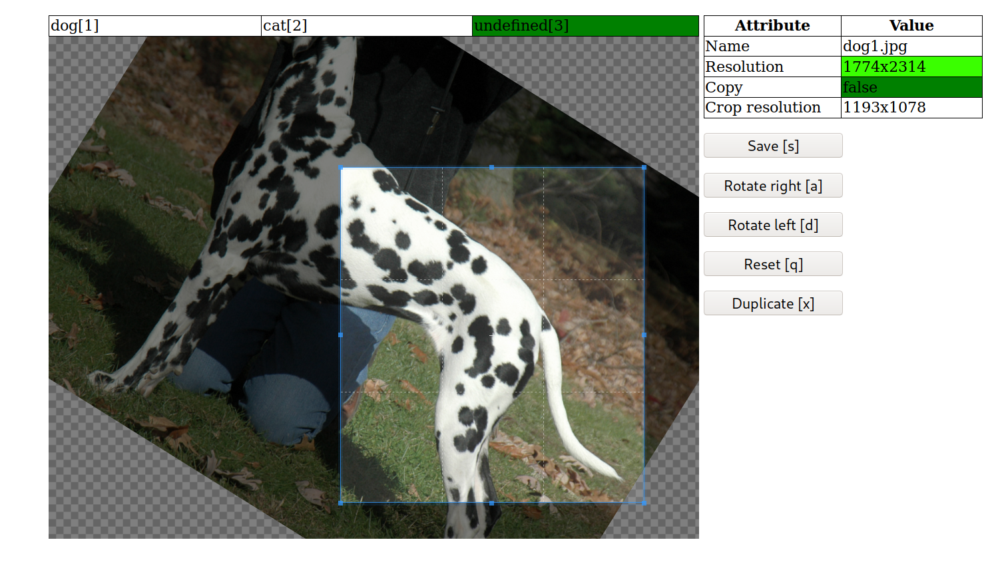

# Super Simple Image Labeler
This project was created out of the need to get simple and fast tool to
label and crop/rotate a lot of images. The intention of this project is not
being a _pretty_ piece of code - it just works and is as simple as possible.



### Features
- Label by keys [1-9]
- rotate [a,d]
- save [s]
- reset [q]
- duplicate [x]
- Configurable quality indicator
- Based on [Cropper.js](https://fengyuanchen.github.io/cropperjs/)

### Usage
- Clone this repository into a directory which is accessible through an url
- Edit `config.php`:
```php
    'SOURCE_DIR'=> "path_to_source_image_dir",
    'TARGET_DIR' => "path_to_target_dir",
    'CATEGORIES' => array(
            'c' => "cat1",
            'd' => "cat2",
        );
    'PROTO' => "https:// or http://"
```
- Make sure `SOURCE_DIR` and `TARGET_DIR`is writeable by the webserver user
- I highly recommend to setup a `Basic Auth` using a `.htaccess` file:
```apacheconfig
AuthType Basic
AuthName "Simple Image Labeler"
AuthUserFile /path/to/.htpasswd
Require valid-user
```

### What this software does
First, it takes the original file from `SOURCE_DIR`, **moves** it to 
`TARGET_DIR`/`cat/orig`. Then if the images has been cropped and/or rotated,
the new images is created at `TARGET_DIR`/`cat/crop`.


### Disclaimer
This software is **not** secure. You are responsible to restrict access and you
use this software at your own risk!

Feedback and ideas are always welcome!